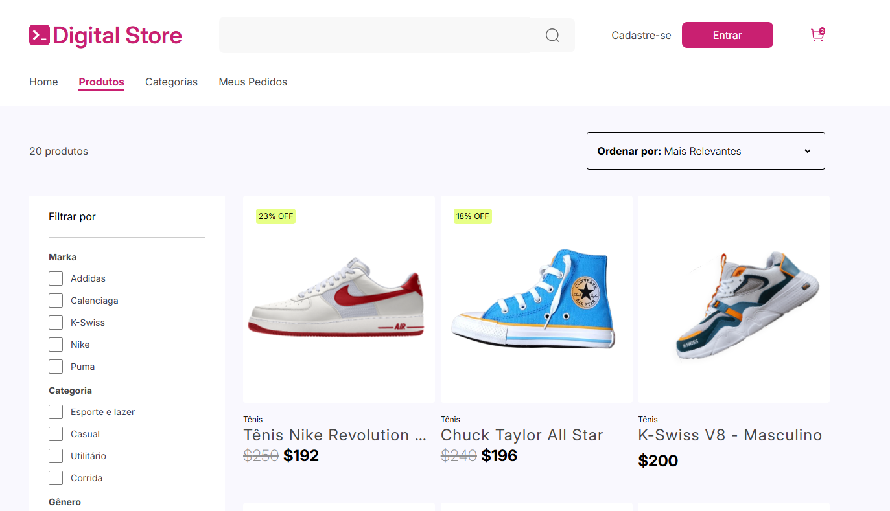
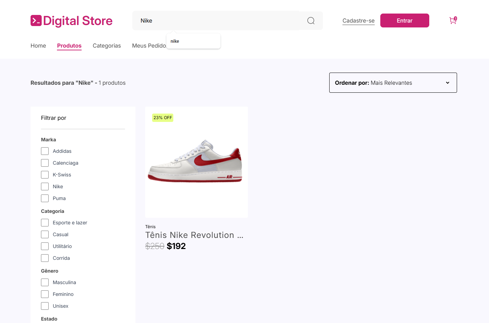

# 👟 Shoe Store - Front-End

## 🚀 Tecnologias Utilizadas

- [React](https://reactjs.org/)
- [Vite](https://vitejs.dev/)
- [Tailwind CSS](https://tailwindcss.com/)
- [Axios](https://axios-http.com/)
- [React Router DOM](https://reactrouter.com/en/main)
- [Context API (React)](https://reactjs.org/docs/context.html)

## 💡 Sobre o Projeto

**Shoe Store** é uma loja virtual fictícia desenvolvida como projeto final da etapa de Front-End do curso Fullstack. O sistema permite:

- Visualizar uma listagem de produtos.
- Ordenar produtos por preço.
- Pesquisar produtos por texto.
- Visualizar os detalhes de um produto com imagens e avaliações.
- Navegação entre páginas via rotas.

## 📂 Estrutura de Pastas

```
src/
├── components/         # Componentes reutilizáveis (ex: Gallery, ProductCard, etc)
├── context/            # Contexto global (ProductProvider)
├── pages/              # Páginas da aplicação (Home, Produtos, Categorias, Meus Pedidos)
├── rotas/              # Definição de rotas com React Router
├── App.jsx             # Componente principal
├── main.jsx            # Ponto de entrada da aplicação
```

## 👥 Equipe

- **Leonardo**
- **Saulo**
- **Rafael**
- **Thalia**
- **Lívia**

## 🛠️ Como Rodar Localmente

1. **Clone o repositório**
   ```bash
   git clone https://github.com/Leo-Gomes/shoe-store-react.git
   cd shoe-store-react
   ```

2. **Instale as dependências**
   ```bash
   npm install
   ```

3. **Rode o projeto**
   ```bash
   npm run dev
   ```

4. Acesse [http://localhost:5173](http://localhost:5173) no navegador.

## 🧪 API

A aplicação consome uma API FAKE externa pública hospedada no [Render](https://render.com/):

```
https://api-products-kpiv.onrender.com/produtos
```

Essa API retorna os dados dos produtos utilizados na loja, incluindo:
- título
- descrição
- preço
- marca
- categoria
- estrelas (avaliação)
- etc.

## 🌐 Deploy 

Caso o projeto esteja publicado, adicione o link aqui:

🔗 [**Acessar a loja online**](https://shoe-store-react-iota.vercel.app/)


## 📸 Imagens






## 📄 Licença

Este projeto é apenas para fins educacionais.